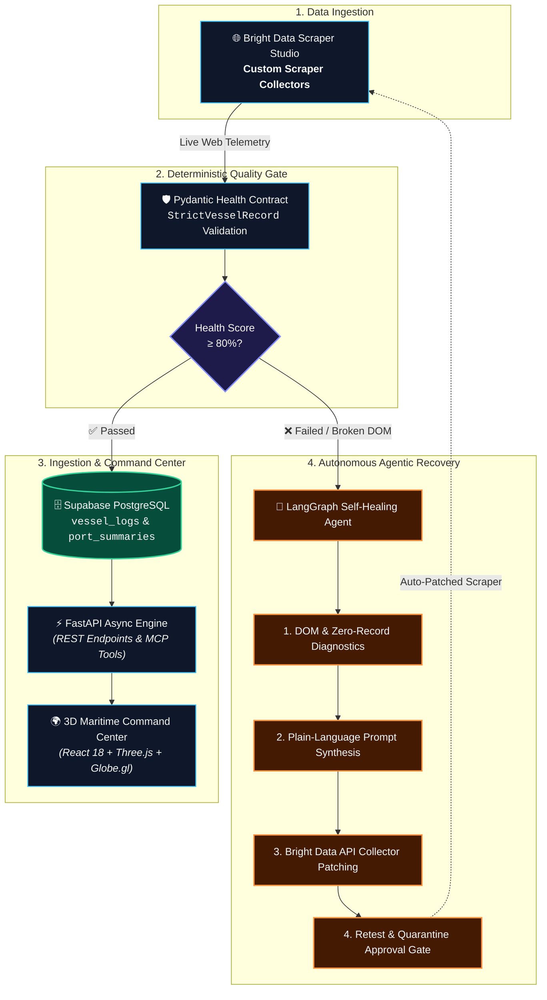

# 🌊 PortPulse: Autonomous Self-Healing Maritime Intelligence

> **Built for the WeMakeDevs × Bright Data Hackathon: "Into the Scrape-Verse"**  
> *Transforming fragmented global port data into real-time, resilient maritime intelligence powered by Bright Data Scraper Studio, LangGraph Self-Healing, and 3D Geospatial Visualizations.*

[](https://brightdata.com)
[](https://langchain.com)
[](https://fastapi.tiangolo.com)
[](https://react.dev)
[](https://threejs.org)
[](https://supabase.com)

---

## 🎯 Executive Overview & The Problem

Global maritime logistics is the backbone of international trade, yet port data remains notoriously fragmented. Commercial container ports publish their daily berthing schedules across dynamic Single Page Applications (SPAs), legacy government portals, and unstandardized daily PDF reports. 

When port websites inevitably change their DOM structures or CSS classes, traditional scrapers fail silently — causing expensive blind spots in supply chain tracking.

**PortPulse** solves this with:
1. **Autonomous Web Scraping**: Driven by custom **Bright Data Scraper Studio Collectors**.
2. **LangGraph Agentic Self-Healing**: Automatically detects DOM breakage, diagnoses root causes, re-synthesizes extraction prompts, and updates scrapers without human downtime.
3. **Multimodal PDF Intelligence**: OCR extraction for deep terminal gate passes and marine bulletins.
4. **Interactive 3D Maritime Command Center**: Real-time berthing manifests, AI situation reports, and an embedded natural-language Maritime Copilot.

---

## 🏗️ Architecture & Open-Closed Design

PortPulse is engineered strictly adhering to the **Open-Closed Principle (OCP)**: **Open for extension, Closed for modification**.



### ⚡ Why PortPulse is "Closed for Modification & Open for Extension"

Adding monitoring for a brand-new seaport requires **zero modifications** to the core runner, validation engine, database persistence layer, API routers, or frontend dashboard:

```python
# app/ports/my_new_port.py (Adding a new port in < 30 lines)
from app.ports.base import BasePortScraper, PortMetadata, VesselRecord

class RotterdamScraper(BasePortScraper):
    @property
    def metadata(self) -> PortMetadata:
        return PortMetadata(
            port_id="nl_rotterdam",
            name="Port of Rotterdam",
            unlocode="NLRTM",
            collector_id="c_custom_rotterdam_collector",
            target_url="https://www.portofrotterdam.com/en/shipping",
            schedule_cron="*/30 * * * *"
        )

    def parse_raw_data(self, raw_items):
        return [VesselRecord(...) for item in raw_items]

# app/ports/registry.py
port_registry.register(RotterdamScraper())
```

Once registered, the new port is automatically:
- Scheduled for background telemetry ingestion via APScheduler cron.
- Enforced with deterministic health scoring and LangGraph self-healing.
- Available across all REST API endpoints (`/port/rotterdam/vessels`, `/port/rotterdam/summary`).
- Rendered on the 3D globe and interactive dashboard selector.

---

## 🛰️ Live Bright Data Scraper Studio Collectors

PortPulse actively collects live maritime telemetry using custom collectors created and verified on **Bright Data Scraper Studio**:

| Port Name | UN/LOCODE | Region | Bright Data Collector ID | Target Portal |
|---|---|---|---|---|
| **JNPA (Nhava Sheva)** | `INNSA` | India (Maharashtra) | `c_mszumjcx12i1k1ydb8` | JNPA Berthing Portal |
| **Mundra Port** | `INMUN` | India (Gujarat) | `c_mt03ofjt15cu3ojzx6` | APSEZ Schedule Hub |
| **Port of Felixstowe** | `GBFXT` | United Kingdom (Suffolk) | `c_mt60nosg1yqb8hzqks` | Ocean Live Shipping |

---

## 🔄 Autonomous Self-Healing Workflow

When a target website updates its DOM or changes table structures:

1. **Deterministic Quality Gate**: Every scrape batch is validated against `StrictVesselRecord` Pydantic models. Critical fields (`vessel_name`, `terminal_name`, `berth_number`) produce a mathematical **Health Score (0–100%)**.
2. **Threshold Trigger**: If health falls below **80.0%** or zero records are returned, the execution is automatically routed to the **LangGraph Self-Healing State Machine**.
3. **Diagnostic Analysis**: The agent inspects the broken payload against historical "Golden Records" to pinpoint broken CSS selectors or dynamic layout shifts.
4. **Prompt Synthesis & Regeneration**: LangGraph generates an exact remediation prompt and uses the **Bright Data API** to re-detect selectors and patch the collector code.
5. **Retest & Quarantine Isolation**: The patched scraper is verified against live endpoints. If health recovers to $\ge 80\%$, it is approved to production; otherwise, it is safely quarantined with an audit event recorded in Supabase.

---

## 🖥️ 3D Maritime Command Center (Dashboard)

The frontend provides an operations-grade command center:

- 🌍 **Interactive 3D Geospatial Earth**: Built with Three.js & Globe.gl displaying real-time commercial port beacons, coordinates, and operational statuses.
- 🚢 **Live Fleet Telemetry Manifest**: Filter vessels by operational status: *At Berth*, *Anchorage*, and *Expected Inbound*, with real-time search across vessel names, LOA, and cargo types.
- 📑 **Multimodal PDF OCR Intelligence**: Extracts vessel movements and gate passes from official port authority PDF bulletins using OCR and vision pipelines.
- 📊 **AI Port Situation Reports**: Generates automated executive situation reports synthesizing terminal congestion, throughput bottlenecks, and turnaround forecasts.
- 🤖 **PortPulse Copilot (RAG Chat)**: Natural language conversational assistant grounded directly in live Supabase telemetry to answer complex supply chain inquiries (e.g., *"Which container vessels are berthed at Felixstowe Berths 8&9?"*).

---

## 📋 Example Structured JSON Output

```json
[
  {
    "vessel_name": "OOCL WISDOM",
    "terminal_name": "Berths 8&9",
    "berth_number": "Berths 8&9",
    "via_number": null,
    "commodity": "Containers (TEU)",
    "berthed_at": "2026-08-19T19:19:00Z",
    "expected_completion_at": "2026-08-23T19:45:00Z",
    "terminal_report_pdf_url": "https://www.portoffelixstowe.co.uk/company-information/marine/",
    "raw_payload": {
      "nationality": "Hong Kong",
      "gross_tonnage": "234,361",
      "overall_length": "400m",
      "last_port": "Singapore",
      "next_port": "Zeebrugge",
      "ships_agent": "OOCL"
    }
  },
  {
    "vessel_name": "MSC CARMELITA",
    "terminal_name": "Trinity",
    "berth_number": "Trinity",
    "via_number": null,
    "commodity": "Containers (TEU)",
    "berthed_at": "2026-08-20T09:25:00Z",
    "expected_completion_at": "2026-08-24T00:00:00Z",
    "terminal_report_pdf_url": "https://www.portoffelixstowe.co.uk/company-information/marine/",
    "raw_payload": {
      "nationality": "Liberia",
      "gross_tonnage": "155,492",
      "overall_length": "366m",
      "last_port": "Bremerhaven",
      "next_port": "Antwerp",
      "ships_agent": "MSC UK"
    }
  }
]
```

---

## 💻 Tech Stack

- **Web Scraping & Proxy**: [Bright Data Scraper Studio](https://brightdata.com), Bright Data CLI (`bdata`), Web Unlocker
- **Agentic AI & Self-Healing**: [LangGraph](https://github.com/langchain-ai/langgraph), [LangChain](https://github.com/langchain-ai/langchain), OpenAI GPT-4o, Pydantic v2
- **Backend API & Data Engine**: FastAPI, Supabase (PostgreSQL), APScheduler, HTTPX, PyPDF
- **Frontend Dashboard**: React 18, Vite, TypeScript, Tailwind CSS, Lucide Icons, Three.js, Globe.gl, Framer Motion, Zustand

---

## 🚀 Quick Start Guide

### Prerequisites
- Python 3.11+
- Node.js 18+
- [Bright Data CLI](https://brightdata.com) (`bdata`) logged into your Bright Data account

### 1. Backend Setup
```bash
# Clone the repository
git clone https://github.com/poojan-solanki/PortPulse.git
cd PortPulse

# Install Python dependencies
uv sync # or pip install -r requirements.txt

# Configure environment variables (.env)
SUPABASE_URL=your_supabase_url
SUPABASE_KEY=your_supabase_anon_or_service_key
OPENAI_API_KEY=your_openai_api_key
BRIGHTDATA_API_TOKEN=your_brightdata_token

# Run the FastAPI server & scraper engine
python main.py
```
*Backend runs locally at `http://localhost:8000` with Swagger docs at `http://localhost:8000/docs`.*

### 2. Frontend Setup
```bash
cd frontend

# Install dependencies and start development server
npm install
npm run dev
```
*Frontend runs locally at `http://localhost:5173` (or integrated at `http://localhost:8000`).*

---

## 🏆 Hackathon Tracks Targeted

- 🥇 **Web-Slinger Track (Grand Prize)**: Deep integration with Bright Data Scraper Studio custom collectors, CLI triggering, and autonomous self-healing recovery.
- 🎨 **Suit-Up Track (Best UI)**: Immersive 3D geospatial globe, live telemetry filters, AI situation reports, and responsive glassmorphism UI.
- 🧠 **Spider-Sense Track (Best Clean Code)**: Production-grade SOLID design, strict Pydantic validation contracts, modular port registry, and clean TypeScript state management.

---
