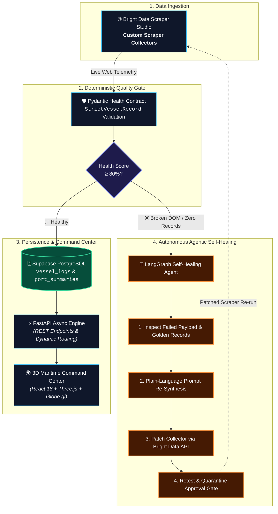

# 🌊 PortPulse: Autonomous Self-Healing Maritime Intelligence

> **Built for the WeMakeDevs × Bright Data Hackathon: "Into the Scrape-Verse"**  
> *Turning messy, fragmented global port data into real-time, clean maritime intelligence using Bright Data Scraper Studio, an autonomous LangGraph self-healing engine, and an interactive 3D geospatial command center.*

[](https://portpulse-production.up.railway.app)
[](https://brightdata.com)
[](https://langchain.com)
[](https://fastapi.tiangolo.com)
[](https://react.dev)
[](https://threejs.org)
[](https://supabase.com)

🔗 **Live Deployment:** [https://portpulse-production.up.railway.app](https://portpulse-production.up.railway.app)

---

## 🛠️ Tech Stack at a Glance

- **Web Scraping & Web Unlocker**: [Bright Data Scraper Studio](https://brightdata.com) (Custom Collectors for JNPA, Mundra, Felixstowe), Bright Data CLI (`bdata`), Bright Data Web Unlocker & SERP API
- **AI Agents & Self-Healing Engine**: [LangGraph](https://github.com/langchain-ai/langgraph) StateGraph, [LangChain](https://github.com/langchain-ai/langchain), OpenAI GPT-4o / Luna, Pydantic v2
- **Backend Core**: FastAPI (Python 3.12 with Astral `uv`), Supabase (PostgreSQL), APScheduler, HTTPX, PyPDF
- **Frontend Dashboard**: React 18, Vite, TypeScript, Tailwind CSS, Three.js, Globe.gl, Framer Motion, Lucide Icons, Zustand
- **Cloud Hosting**: Railway (Lightweight Multi-stage Docker with Astral `uv` + Node builder)

---

## 🖥️ What’s Happening in the Dashboard & How It Works

We built PortPulse to look and feel like a modern aerospace and maritime mission control center. Here is a breakdown of what you see on the dashboard and how each piece is implemented behind the scenes:

### 1. 🌍 Interactive 3D Globe & Port Beacon System
- **What you see**: A glowing 3D Earth rendered in dark mode with pulsing beacons over key global ports (JNPA Mumbai, Mundra Port, Port of Felixstowe UK). Clicking any port smoothly rotates the camera and loads its real-time telemetry.
- **How we built it**: We combined **Three.js** and **Globe.gl** inside React. When a user clicks a beacon, a reactive state change triggers high-speed async REST calls to fetch the latest berth manifests and updates the camera position with smooth interpolation.

### 2. 🚢 Live Ship Data & Vessel Manifests
- **What you see**: A searchable, filterable grid displaying every cargo ship currently docked at a berth, waiting out at anchorage, or scheduled to arrive. You can see exact berth numbers, arrival/departure timestamps, Length Overall (LOA), Gross Tonnage, cargo types (TEU containers, chemicals, dry bulk), and shipping agents.
- **How we built it**: Our **Bright Data Scraper Studio Collectors** crawl live seaport marine portals on recurring cron intervals. We validate every single scraped record through strict **Pydantic contracts** (`StrictVesselRecord`), calculate a live **Health Score (0–100%)**, and save clean normalized records into **Supabase PostgreSQL**. The frontend streams this via FastAPI with instant client-side search.

### 3. 📊 AI Situation Reports (Executive Port Briefings)
- **What you see**: At the top of every port view, there is an instant intelligence summary explaining terminal congestion levels, average ship turnaround times, berth occupancy percentage, and any operational bottlenecks.
- **How we built it**: Whenever fresh scraper data enters the system, an AI summarization pipeline analyzes the entire vessel manifest. It aggregates metrics (e.g. ratio of berthed vs waiting ships, dwell times) and generates a structured, easy-to-read situational brief stored directly in the database.

### 4. 💬 PortPulse AI Maritime Copilot (Chatbot)
- **What you see**: A built-in conversational assistant in the sidebar. You can ask anything from *"Which container ships are berthed at Felixstowe Berths 8&9?"* to *"What is the anchorage queue in Mundra right now?"* or *"Search the web for weather alerts at Mumbai port."*
- **How we built it**: Powered by **LangGraph** and Model Context Protocol (MCP) tool bindings. The agent dynamically decides whether to query our **Supabase database** for cached ship telemetry, extract text from terminal PDF gate bulletins, or invoke **Bright Data Web Unlocker / SERP search** for live carrier advisories.

### 5. 📑 Multimodal Terminal PDF OCR Agent
- **What you see**: Dedicated terminal reports with deep operational metrics (like crane moves and alongside draft depths) extracted straight from daily port authority PDF bulletins.
- **How we built it**: An automated PDF processing pipeline downloads daily gate bulletins from port marine portals, parses messy tables using PyPDF and OCR vision fallback, structures the text into clean JSON, and registers it to the vessel database.

---

## 💡 The Problem & Why We Built This

Ever tried tracking commercial cargo ships across different global ports? It is honestly chaotic.

Global trade relies completely on maritime shipping, but every major port formats their data differently. Some use single-page web applications with protected APIs, others publish raw HTML tables, and some literally dump daily berthing manifests into PDFs on obscure government portals. 

To make matters worse, as soon as a port updates their website layout or CSS classes, traditional web scrapers break instantly without anyone noticing.

We built **PortPulse** to fix this entire pipeline:
1. **Scrape live port telemetry reliably** using custom **Bright Data Scraper Studio Collectors**.
2. **Auto-heal broken scrapers** using a **LangGraph agentic state machine** that diagnoses DOM shifts and rewrites extraction prompts without human intervention.
3. **Parse unstructured PDF gate manifests** using multimodal vision & OCR pipelines.
4. **Display everything in an interactive 3D Command Center** with live vessel logs, AI situation reports, and an AI maritime copilot.

---

## 🏗️ System Architecture



---

## 🛰️ Active Bright Data Scraper Studio Collectors

We built and verified custom scrapers in **Bright Data Scraper Studio** to extract live shipping manifests:

| Port Name | UN/LOCODE | Region | Bright Data Collector ID | Target Portal |
|---|---|---|---|---|
| **JNPA (Nhava Sheva)** | `INNSA` | India (Maharashtra) | `c_mszumjcx12i1k1ydb8` | JNPA Live Berthing Portal |
| **Mundra Port** | `INMUN` | India (Gujarat) | `c_mt03ofjt15cu3ojzx6` | APSEZ Schedule Hub |
| **Port of Felixstowe** | `GBFXT` | United Kingdom (Suffolk) | `c_mt60nosg1yqb8hzqks` | Ocean Live Shipping Marine Portal |

---

## 🤖 The Autonomous Self-Healing Magic

What happens when a port changes its webpage layout?

1. **Quality Check**: Every scrape gets validated against strict Pydantic rules. We calculate an exact **Health Score (0–100%)** based on required fields (`vessel_name`, `terminal_name`, `berth_number`, timestamps).
2. **Auto-Trigger**: If the health score drops below **80%** or returns zero records, the scraper is flagged and handed over to our **LangGraph Agent**.
3. **Diagnosis**: LangGraph compares the broken output against historical "Golden Records" to figure out which CSS selectors or table layouts changed.
4. **Prompt Synthesis & Patch**: The agent generates an updated extraction prompt and patches the scraper via the **Bright Data API**.
5. **Retest & Deploy**: If the patched collector recovers above 80% health on retest, it gets automatically promoted back to production. Otherwise, it safely isolates into quarantine with an audit log in Supabase.

---

## 📦 Sample Normalized Output (JSON)

Here is what our normalized pipeline produces from messy port websites:

```json
[
  {
    "vessel_name": "OOCL WISDOM",
    "terminal_name": "Berths 8&9",
    "berth_number": "Berths 8&9",
    "via_number": null,
    "commodity": "Containers (TEU)",
    "berthed_at": "2026-08-19T19:19:00Z",
    "expected_completion_at": "2026-08-23T19:45:00Z",
    "terminal_report_pdf_url": "https://www.portoffelixstowe.co.uk/company-information/marine/",
    "raw_payload": {
      "nationality": "Hong Kong",
      "gross_tonnage": "234,361",
      "overall_length": "400m",
      "last_port": "Singapore",
      "next_port": "Zeebrugge",
      "ships_agent": "OOCL"
    }
  }
]
```

---

## 🚀 Running Locally

### 1. Backend Setup
```bash
# Clone the repository
git clone https://github.com/poojan-solanki/PortPulse.git
cd PortPulse

# Install dependencies using Astral uv (or pip)
uv sync # or pip install -r requirements.txt

# Create your .env file with Supabase and OpenAI keys
SUPABASE_URL=https://your-project.supabase.co
SUPABASE_KEY=your-anon-or-service-key
OPENAI_API_KEY=sk-proj-your-key
BRIGHTDATA_API_TOKEN=your-brightdata-token

# Start FastAPI server & cron engine
python main.py
```
*Backend runs locally at `http://localhost:8000` (interactive Swagger API docs at `http://localhost:8000/docs`).*

### 2. Frontend Setup
```bash
cd frontend
npm install
npm run dev
```
*Frontend runs locally at `http://localhost:5173`.*

---

## 🏆 Hackathon Tracks Targeted

- 🥇 **Web-Slinger Track (Grand Prize)**: Deep integration of Bright Data Scraper Studio collectors, autonomous LangGraph self-healing, and end-to-end maritime intelligence pipeline.
- 🎨 **Suit-Up Track (Best UI)**: Sleek, responsive dark-mode command center featuring an interactive 3D Three.js globe, glassmorphic styling, and AI situation insights.
- 🧠 **Spider-Sense Track (Best Clean Code)**: Open-Closed SOLID architecture, modular port registry pattern, strict Pydantic validation contracts, and clean TypeScript state management.

---

⭐ **Built with passion for the WeMakeDevs × Bright Data Hackathon!**
