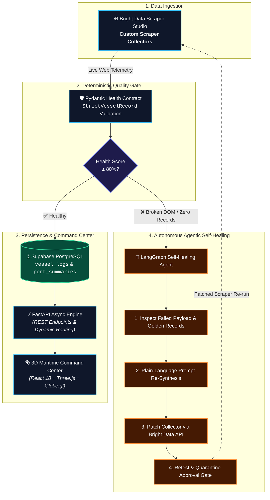

# 🌊 PortPulse: Autonomous Self-Healing Maritime Intelligence

> **Built for the WeMakeDevs × Bright Data Hackathon: "Into the Scrape-Verse"**  
> *Turning messy, fragmented global port data into real-time, clean maritime intelligence using Bright Data Scraper Studio, an autonomous LangGraph self-healing engine, and an interactive 3D geospatial command center.*

[](https://portpulse-production.up.railway.app)
[](https://brightdata.com)
[](https://langchain.com)
[](https://fastapi.tiangolo.com)
[](https://react.dev)
[](https://threejs.org)
[](https://supabase.com)

🔗 **Live Deployment:** [https://portpulse-production.up.railway.app](https://portpulse-production.up.railway.app)

---

## 🛠️ Tech Stack at a Glance

- **Web Scraping & Web Unlocker**: [Bright Data Scraper Studio](https://brightdata.com) (Custom Collectors for JNPA, Mundra, Felixstowe), Bright Data CLI (`bdata`), Bright Data Web Unlocker & SERP API
- **AI Agents & Self-Healing Engine**: [LangGraph](https://github.com/langchain-ai/langgraph) StateGraph, [LangChain](https://github.com/langchain-ai/langchain), OpenAI GPT-4o / Luna, Pydantic v2
- **Backend Core**: FastAPI (Python 3.12 with Astral `uv`), Supabase (PostgreSQL), APScheduler, HTTPX, PyPDF
- **Frontend Dashboard**: React 18, Vite, TypeScript, Tailwind CSS, Three.js, Globe.gl, Framer Motion, Lucide Icons, Zustand
- **Cloud Hosting**: Railway (Lightweight Multi-stage Docker with Astral `uv` + Node builder)

---

## 🖥️ What the Dashboard Shows

### 1. 🌍 Interactive 3D Globe
- **What it shows**: A 3D interactive globe with clickable pins on major ports (JNPA Mumbai, Mundra Port, Port of Felixstowe UK). Clicking a pin rotates the globe and loads live port data.
- **How it's built**: Built using **Three.js** and **Globe.gl** in React. Selecting a port queries FastAPI to fetch cached records from Supabase.

### 2. 🚢 Live Ship Schedules & Berth Tracking
- **What it shows**: Real-time list of ships docked at berths, waiting in anchorage, or scheduled to arrive. Displays berth numbers, arrival times, ship dimensions (LOA), gross tonnage, cargo types, and shipping agents.
- **How it's built**: **Bright Data Scraper Studio** collectors scrape port portals on cron schedules. Data is validated with **Pydantic**, assigned a quality score (0–100%), and stored in **Supabase**.

### 3. 📊 AI Port Summaries
- **What it shows**: A quick summary for each port highlighting congestion levels, wait times, berth occupancy, and delays.
- **How it's built**: When new scraper data is saved, an LLM summarizer processes the vessel list and creates a short operational brief in the database.

### 4. 💬 PortPulse AI Copilot (Chatbot)
- **What it shows**: A sidebar assistant that answers questions about port traffic, docked vessels, queues, or maritime weather alerts.
- **How it's built**: Built with **LangGraph**. It autonomously queries **Supabase** for local ship data or searches the web via **Bright Data Web Unlocker / SERP API**.

### 5. 📑 Terminal PDF Report Parser
- **What it shows**: Terminal data (draft depths, alongside dates, TEU balance) extracted from daily port authority PDF bulletins.
- **How it's built**: Downloads PDF bulletins from port websites, parses tables with PyPDF and OCR fallback, and saves structured JSON into the database.

---

## 💡 The Problem & Why We Built This

Ever tried tracking commercial cargo ships across different global ports? It is honestly chaotic.

Global trade relies completely on maritime shipping, but every major port formats their data differently. Some use single-page web applications with protected APIs, others publish raw HTML tables, and some literally dump daily berthing manifests into PDFs on obscure government portals. 

To make matters worse, as soon as a port updates their website layout or CSS classes, traditional web scrapers break instantly without anyone noticing.

We built **PortPulse** to fix this entire pipeline:
1. **Scrape live port telemetry reliably** using custom **Bright Data Scraper Studio Collectors**.
2. **Auto-heal broken scrapers** using a **LangGraph agentic state machine** that diagnoses DOM shifts and rewrites extraction prompts without human intervention.
3. **Parse unstructured PDF gate manifests** using multimodal vision & OCR pipelines.
4. **Display everything in an interactive 3D Command Center** with live vessel logs, AI situation reports, and an AI maritime copilot.

---

## 🏗️ System Architecture



---

## 🛰️ Active Bright Data Scraper Studio Collectors

We built and verified custom scrapers in **Bright Data Scraper Studio** to extract live shipping manifests:

| Port Name | UN/LOCODE | Region | Bright Data Collector ID | Target Portal |
|---|---|---|---|---|
| **JNPA (Nhava Sheva)** | `INNSA` | India (Maharashtra) | `c_mszumjcx12i1k1ydb8` | JNPA Live Berthing Portal |
| **Mundra Port** | `INMUN` | India (Gujarat) | `c_mt03ofjt15cu3ojzx6` | APSEZ Schedule Hub |
| **Port of Felixstowe** | `GBFXT` | United Kingdom (Suffolk) | `c_mt60nosg1yqb8hzqks` | Ocean Live Shipping Marine Portal |

---

## 🤖 The Autonomous Self-Healing Magic

What happens when a port changes its webpage layout?

1. **Quality Check**: Every scrape gets validated against strict Pydantic rules. We calculate an exact **Health Score (0–100%)** based on required fields (`vessel_name`, `terminal_name`, `berth_number`, timestamps).
2. **Auto-Trigger**: If the health score drops below **80%** or returns zero records, the scraper is flagged and handed over to our **LangGraph Agent**.
3. **Diagnosis**: LangGraph compares the broken output against historical "Golden Records" to figure out which CSS selectors or table layouts changed.
4. **Prompt Synthesis & Patch**: The agent generates an updated extraction prompt and patches the scraper via the **Bright Data API**.
5. **Retest & Deploy**: If the patched collector recovers above 80% health on retest, it gets automatically promoted back to production. Otherwise, it safely isolates into quarantine with an audit log in Supabase.

---

## 📦 Sample Normalized Output (JSON)

Here is what our normalized pipeline produces from messy port websites:

```json
[
  {
    "vessel_name": "OOCL WISDOM",
    "terminal_name": "Berths 8&9",
    "berth_number": "Berths 8&9",
    "via_number": null,
    "commodity": "Containers (TEU)",
    "berthed_at": "2026-08-19T19:19:00Z",
    "expected_completion_at": "2026-08-23T19:45:00Z",
    "terminal_report_pdf_url": "https://www.portoffelixstowe.co.uk/company-information/marine/",
    "raw_payload": {
      "nationality": "Hong Kong",
      "gross_tonnage": "234,361",
      "overall_length": "400m",
      "last_port": "Singapore",
      "next_port": "Zeebrugge",
      "ships_agent": "OOCL"
    }
  }
]
```

---

## 🚀 Running Locally

### 1. Backend Setup
```bash
# Clone the repository
git clone https://github.com/poojan-solanki/PortPulse.git
cd PortPulse

# Install dependencies using Astral uv (or pip)
uv sync # or pip install -r requirements.txt

# Create your .env file with Supabase and OpenAI keys
SUPABASE_URL=https://your-project.supabase.co
SUPABASE_KEY=your-anon-or-service-key
OPENAI_API_KEY=sk-proj-your-key
BRIGHTDATA_API_TOKEN=your-brightdata-token

# Start FastAPI server & cron engine
python main.py
```
*Backend runs locally at `http://localhost:8000` (interactive Swagger API docs at `http://localhost:8000/docs`).*

### 2. Frontend Setup
```bash
cd frontend
npm install
npm run dev
```
*Frontend runs locally at `http://localhost:5173`.*

---

## 🏆 Hackathon Tracks Targeted

- 🥇 **Web-Slinger Track (Grand Prize)**: Deep integration of Bright Data Scraper Studio collectors, autonomous LangGraph self-healing, and end-to-end maritime intelligence pipeline.
- 🎨 **Suit-Up Track (Best UI)**: Sleek, responsive dark-mode command center featuring an interactive 3D Three.js globe, glassmorphic styling, and AI situation insights.
- 🧠 **Spider-Sense Track (Best Clean Code)**: Open-Closed SOLID architecture, modular port registry pattern, strict Pydantic validation contracts, and clean TypeScript state management.

---

⭐ **Built with passion for the WeMakeDevs × Bright Data Hackathon!**
