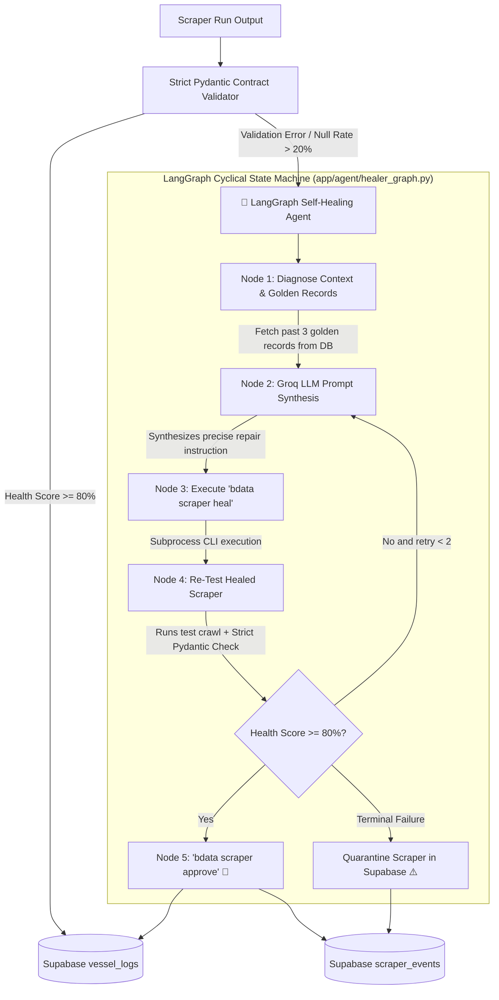

# 🛡️ PortPulse Autonomous Self-Healing Architecture

> **Author:** PortPulse Team  
> **Frameworks:** LangGraph, LangChain Groq (`llama-3.3-70b-versatile`), Pydantic v2, Bright Data CLI (`bdata`), Supabase

---

## 1. Executive Summary & Core Invariant

The central objective of PortPulse's self-healing engine is **Zero Silent Data Corruption**:
> *"An automated scraper repair is valid ONLY when two independent proofs pass:*
> 1. *The collector executes without transport/runtime errors.*
> 2. *The output strictly satisfies the Pydantic field contract with zero placeholder or null values."*

Instead of relying on human intervention, PortPulse deploys an **Autonomous LangGraph AI Agent** that diagnoses breakage, synthesizes surgical prompts, triggers Bright Data refactoring, re-tests output, and auto-promotes to production with full database audit logging.

---

## 2. Complete End-to-End State Machine



---

## 3. Component Architecture & Code Mapping

### 🔹 Layer 1: Strict Pydantic Contracts (`app/health/contracts.py`)
Replaces loose `Dict[str, Any]` with strict field constraints:
- **`StrictVesselRecord`**:
  - Rejects placeholders (`"VACANT"`, `"NULL"`, `"N/A"`, `"-"`).
  - Enforces ISO-8601 parsing via `python-dateutil` with day-first fallback.
  - Required fields: `vessel_name`, `terminal_name`, `berth_number`.
- **`validate_raw_records()`**:
  - Calculates missing fields, null rates, and a deterministic `health_score` (0.0% to 100.0%).

---

### 🔹 Layer 2: LangGraph State Machine (`app/agent/healer_graph.py`)
Implements `HealingState(TypedDict)` across 5 discrete nodes:

1. **`node_diagnose_context`**:
   - Queries Supabase for the last 3 golden records when the port was healthy.
   - Compares past schema against broken raw items to isolate selector or structural drift.
2. **`node_synthesize_prompt`**:
   - Invokes `ChatGroq(model="llama-3.3-70b-versatile")`.
   - Generates a surgical prompt under 400 characters describing the exact broken selectors and target fields.
3. **`node_trigger_bdata_heal`**:
   - Runs `bdata scraper heal <collector_id> "<synthesized_prompt>"` via `subprocess`.
4. **`node_retest_and_verify`**:
   - Runs `bdata scraper run <collector_id> <target_url> --json`.
   - Evaluates the new test output using `validate_raw_records()`.
5. **`node_approve_and_promote`**:
   - If health $\ge 80\%$: Runs `bdata scraper approve <collector_id>`, saves records, and logs `"healing_auto_healed"`.
   - If health $< 80\%$: Retries up to 2 times, then logs `"healing_quarantined"`.

---

### 🔹 Layer 3: Scraper Runner Bridge (`app/services/runner.py`)
- **`ScraperRunner.run_port(port_id)`**: Executes `bdata scraper run`, intercepts exit codes, and invokes the LangGraph Agent on failure.
- **`ScraperRunner.ingest_records(port_id, raw_data)`**: Validates all incoming batches; triggers self-healing on any data quality breach.

---

### 🔹 Layer 4: Audit Trail & API Endpoints (`main.py`)
- **`GET /events`**: Returns full execution and error audit logs.
- **`GET /events/healing`**: Dedicated endpoint returning real-time self-healing timeline events with LangGraph trace details, prompts, and health score deltas.
- **`POST /scrapers/{port_id}/run`**: On-demand live scraper trigger for judges and dashboard demo.

---

## 4. Hackathon Presentation & Demo Script

1. **Step 1 (Normal Operations):**
   - Query `GET /port/jnpt` ➔ Returns 16 live vessels with 100% health.
2. **Step 2 (Simulate Failure):**
   - Trigger a broken scraper payload with placeholder fields (`VACANT`, `NULL`).
3. **Step 3 (Agentic Self-Healing):**
   - Terminal logs show:
     ```
     🚨 [Runner] Data Quality Breach for JNPT (Health: 0.0%). Triggering LangGraph Agent...
     🕵️ [Agent:Diagnose] Gathered 3 golden records from Supabase.
     🧠 [Agent:GroqLLM] Synthesized prompt: 'Table column changed. Extract vessel_name...'
     ⚡ [Agent:CLI] Executing 'bdata scraper heal c_mszumjcx12i1k1ydb8'...
     🧪 [Agent:Verify] Re-test Health Score: 100.0% | Valid: True
     🚀 [Agent:Approve] Approving to production via 'bdata scraper approve'!
     ```
4. **Step 4 (Verify Audit Trail):**
   - Query `GET /events/healing` ➔ Shows `"status": "APPROVED_TO_PRODUCTION"` with complete before/after health deltas.
