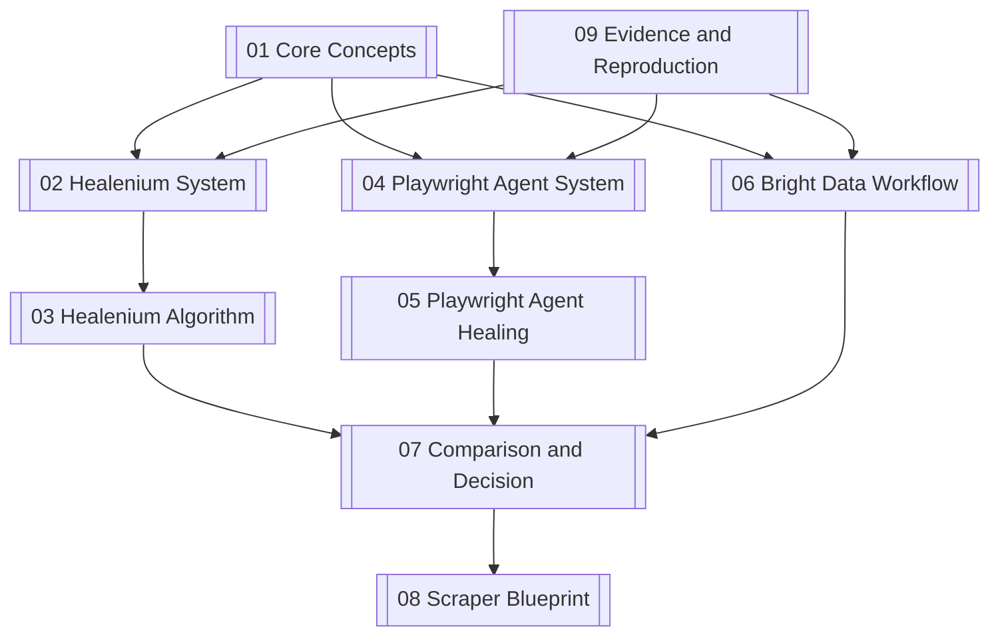

# Map of Content

## Foundations

- [[01-Core-Concepts]] — precise vocabulary, failure taxonomy, and the “no silent corruption” rule.
- [[07-Comparison-and-Decision]] — how the three approaches differ and when to use each.
- [[08-Scraper-Blueprint]] — a recommended design for the Scrape-Verse project.

## Repository deep dives

- [[02-Healenium-System]] — low-level proxy, backend, processor-chain, and persistence architecture.
- [[03-Healenium-Algorithm]] — what gets captured, how candidates are generated, and what the score can and cannot prove.
- [[04-Playwright-Agent-System]] — ActionEngine, registry persistence, error classification, and source patching.
- [[05-Playwright-Agent-Healing]] — Scout, candidate ranking, state machine, seven AI gates, and design caveats.
- [[06-BrightData-Workflow]] — official CLI flow around hosted self-healing.

## Evidence

- [[09-Evidence-and-Reproduction]] — exact repository revisions, files inspected, and tests run.

## Concept graph

