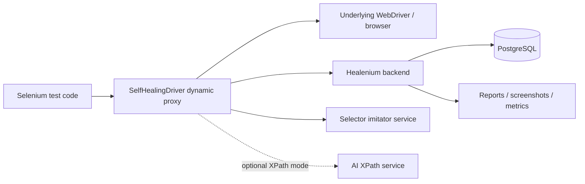
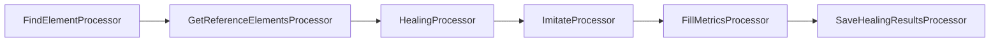

# Healenium System Architecture

Healenium is a Selenium-oriented locator-healing system. The implementation examined is the `healenium-web` client, supported by the parent deployment repository. It is not an LLM-first design; its core mechanism is historical DOM-path comparison.

See [[03-Healenium-Algorithm]] for the candidate-ranking path.

## Deployment topology



The parent `healenium` repository provides Compose wiring for PostgreSQL, an `hlm-backend` service, and a selector-imitator service. The Java `healenium-web` library runs inside the test process and performs browser interception.

## Initialization path

`SelfHealingDriver.create(delegate)` performs these steps:

1. constructs a `SelfHealingEngine` around the normal Selenium `WebDriver`;
2. creates a `RestClient`, `NodeService`, `HealingService`, and `SessionContext`;
3. loads persisted enable/disable selector configuration from the backend;
4. initializes a report session;
5. returns a runtime-generated `WebDriver` proxy.

The caller continues to call ordinary `findElement`/`findElements`. The Java dynamic proxy intercepts those calls and delegates non-intercepted methods directly to the real driver.

## Interception boundary

```text
caller.findElement(By)
  → SelfHealingProxyInvocationHandler.invoke()
  → BaseHandler.findElement()
  → processor chain
  → normal WebDriver result OR healed WebElement
```

The proxy also wraps returned elements and `switchTo()` locators, so element-level operations remain inside the same interception model. Healing can be disabled globally or per selector; wait commands have special handling to avoid recursively interpreting ordinary wait behavior as an opportunity to heal.

## Processor-chain design

The library uses a Chain of Responsibility. A `BaseProcessor` executes only when its `validate()` returns true, then injects shared objects into the next processor: `Context`, driver, engine, REST client, healing service.

For `findElement`, the meaningful stages are:



- **FindElementProcessor** first calls the original Selenium locator. On success it serializes the matched element path and stores it. On `NoSuchElementException`, it records the exception but does not immediately throw.
- **GetReferenceElementsProcessor** reads prior path data keyed by locator, command, origin test class/method, URL, and session configuration.
- **HealingProcessor** parses the current page and searches for structurally similar candidates.
- **ImitateProcessor** asks the selector-imitator service to express the healed node in forms related to the original selector, then updates the chosen candidate if the imitation maps uniquely to the same browser element.
- **FillMetricsProcessor** records current DOM, user selector, target node, and candidates for reporting.
- **SaveHealingResultsProcessor** takes the first candidate, optionally captures a highlighted screenshot, adds the element to the current result, and posts the healing report.

## What is persisted

The success path posts `RequestDto` data to the backend. It includes the original locator metadata and a **node path** from document root to the matched element. Healing posts the chosen selector, alternatives, score, screenshot, page source, and metrics.

Selector identity is not only `By.cssSelector(...)`. `HealeniumMapper` finds the test-origin class and method from the stack trace, maps Selenium `By` types to `{type, value}`, and includes command and URL. That lowers accidental sharing of a locator between unrelated test flows.

## What this system is and is not

It heals lookup of a browser element. It does **not** natively know a scraper’s field schema, values, or business semantics. It therefore needs the verification layer proposed in [[08-Scraper-Blueprint]] when repurposed for data extraction.

