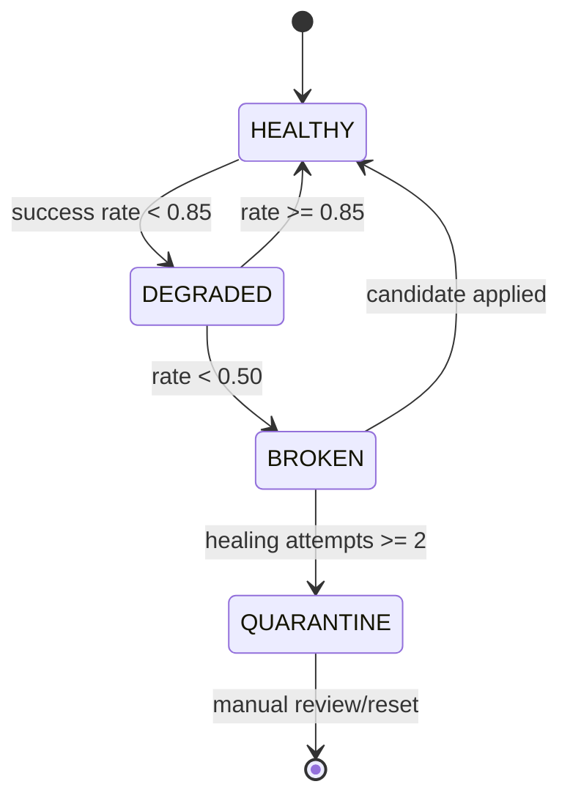

# Playwright AI Agent: Runtime System

This repository treats selector health as explicit state. It is designed for Playwright browser tests, but its state and evidence patterns are valuable for scrapers.

For discovery and repairing behavior see [[05-Playwright-Agent-Healing]].

## Code architecture

```text
elements → BasePage → page object → test
                 ↓
          selector registry
                 ↓
           Scout / healing
```

| Directory | Role |
|---|---|
| `src/elements/` | Small locator-builder functions, one file per page |
| `src/pages/BasePage.js` | Central action/assertion wrapper and health tracking |
| `src/pages/*.page.js` | Business-level page methods |
| `src/tests/` | Playwright specs |
| `src/registry/` | Registry state transitions and candidate application |
| `src/agent/` | Scout, CLI, and LLM orchestration |
| `.agent/` | Runtime JSON state: registry, Scout outputs, patch queues |

## Action interception

`BasePage` owns `fill`, `click`, `selectOption`, `getText`, `isVisible`, `assertVisible`, and `assertText`. Each wraps a Playwright action:

```text
execute locatorFn(page).action()
  → success: record selector success
  → exception: classify error
      → locator-related: record selector failure
      → environment/assertion: rethrow without degrading selector
```

This avoids a common mistake: treating every test failure as selector drift. Its classifier excludes browser closure, `net::ERR_*`, navigation failures, crashes, protocol errors, and assertion failures. It treats action timeouts, strict-mode violations, detached/blocked elements, and locator waits as locator issues.

## Registry record

Each key such as `Checkout.submitButton` stores:

```json
{
  "locator": "page.getByRole('button', { name: 'Submit' })",
  "tier": 1,
  "state": "HEALTHY",
  "success_rate": 1.0,
  "total_runs": 17,
  "successful_runs": 17,
  "heal_attempts": 0,
  "heal_version": 0,
  "last_seen": "...",
  "last_heal_source": "scout-generated",
  "source_file": "src/elements/Checkout.elements.js"
}
```

Unknown keys are registered dynamically. The project extracts a locator string by inspecting `locatorFn.toString()` and infers its tier:

- Tier 1: `getByRole`, `getByLabel`;
- Tier 2: test-id/data-test/data-qa selectors;
- Tier 3: generic `locator(...)` calls.

That is pragmatic but brittle: source-string introspection is not an AST. A production system should store a structured locator descriptor at definition time instead.

## State machine



The threshold is calculated over all recorded runs, not a moving window. That preserves long-term history but delays recognition of sudden redesigns after a large number of historic successes. A scraper should retain both a short window and a lifetime metric; see [[08-Scraper-Blueprint]].

## Parallel-worker persistence

Playwright workers have independent Node processes. The design avoids module-load staleness by lazily loading the registry on first use.

Writes are debounced for 500 ms and flushed on normal exit, `SIGINT`, and `SIGTERM`. `mergeAndSave()` uses a lock file, reloads on-disk JSON under that lock, then chooses the record with higher `total_runs` per key; ties use newer `last_seen`. It writes a temporary file and renames it, minimizing partial JSON writes.

This is a thoughtful lightweight design, but it is not a transactional database. A high-throughput scraper should use an actual shared store with optimistic versioning or append-only events.

## Source patching

When an orchestrated repair includes `registry_updates`, the orchestrator:

1. updates the JSON registry;
2. finds the matching locator line in `src/elements/<Page>.elements.js`;
3. replaces it with the repaired selector plus a provenance comment;
4. atomically renames a temporary file.

This means a repair affects future deterministic test runs rather than repeatedly needing model inference.

The orchestration and its constraints are detailed in [[05-Playwright-Agent-Healing]].

