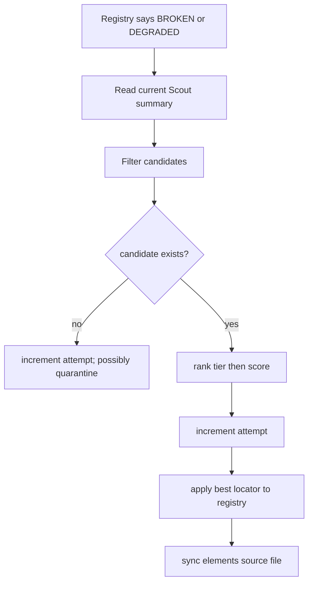

# Playwright AI Agent: Discovery and Healing

This note covers the repair decision path that sits on top of the runtime system in [[04-Playwright-Agent-System]].

## Scout: compact current-page evidence

`src/agent/scout.js` launches Playwright, loads a URL, and collects four kinds of evidence:

1. **Chrome CDP accessibility tree** — interactive roles, accessible names, disabled state.
2. **DOM overlay** — visible inputs/buttons/links and `data-test`, `data-qa`, `data-testid`, ID, placeholder, ARIA label, type.
3. **Raw HTML size** — used to estimate compact-context/token reduction.
4. **Shadow DOM and iframe presence** — emitted as warnings because ordinary selectors may need a different boundary.

It merges a11y and DOM candidates by normalized name/label/hook. Each Scout result includes a suggested locator and provenance:

```json
{
  "key": "Login.signIn",
  "role": "button",
  "label": "Sign in",
  "tier_suggestion": 1,
  "locator_suggestion": "page.getByRole('button', { name: 'Sign in' })",
  "source": "a11y+dom"
}
```

This avoids sending full HTML to a model and anchors repair in accessible user-facing semantics.

## Candidate discovery

`HealManager.findCandidates()` reads the current page’s Scout summary and the failed key’s registry record.

It excludes:

- missing Scout or registry data;
- disabled elements;
- the current selector;
- Tier-3 selectors unless explicitly allowed.

Scoring rewards exact/partial key match, matching labels, combined a11y+DOM provenance, and better tier. Final ordering is **tier first, score second**. This means a semantically weaker Tier-1 candidate can precede an exact-name Tier-2 candidate.

## Healing operation



`applyHeal()` resets `total_runs` and `successful_runs` to zero and sets `success_rate` to `1.0`, increments a repair version, and records the source. The local unit tests verify this behavior.

## LLM orchestration: hard boundary

The LLM is not permitted to directly browse, write files, or decide all policy. The orchestrator loads current machine-readable context and applies seven deterministic gates:

1. input presence;
2. stale method-index acknowledgement;
3. registry state resolution;
4. Scout element filtering;
5. duplicate config-patch prevention;
6. explicit Tier-3 permission;
7. post-response JSON envelope validation.

After the model returns JSON, the orchestrator rejects writes outside a fixed directory allow-list and then applies validated registry/file changes. This is an excellent general rule for agentic repair: **models propose a constrained patch; deterministic code enforces authority and persistence.**

## Critical caveats

### 1. No validation before promotion

The code selects a candidate and applies it to the registry without rerunning the browser action. It does not verify that an extraction value is correct. For testing, a later test run provides feedback. For scraping, this must be replaced with candidate replay on several pages plus schema/business validation.

### 2. Quarantine is intentionally aggressive

`heal_attempts >= 2` overrides even a `1.0` success rate. Because the counter persists across successful heals, the second attempted repair results in quarantine. This limits runaway repair but will create manual work on frequently redesigned sites.

### 3. Lifetime rate hides sudden drift

After 1,000 successful runs, several recent failures barely affect the success rate. Add a recent-failure circuit breaker and layout/change-point detector.

### 4. Source-string locator parsing is fragile

Calling `locatorFn.toString()` is convenient but dependent on code style and JavaScript representation. Store a structured locator descriptor instead.

### 5. Tests and scrapers have different “truth”

A browser test may accept “the button was found.” A scraper must prove “the returned 51.77 GBP is the intended product’s current price.” See [[01-Core-Concepts]] and [[08-Scraper-Blueprint]].

