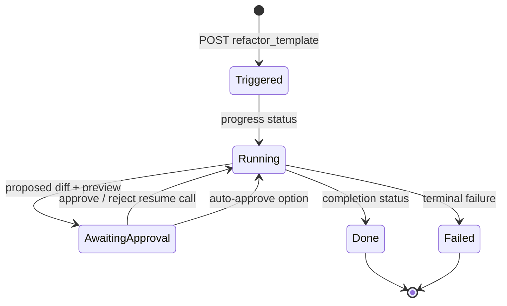

# Bright Data CLI: Hosted Self-Healing Workflow

The cloned Bright Data CLI contains the client-side orchestration for Scraper Studio’s hosted self-healing flow. It is important to separate what the CLI verifies locally from what happens inside Bright Data’s hosted AI service.

See [[07-Comparison-and-Decision]] for positioning relative to Healenium and the Playwright project.

## What the CLI actually implements

`src/commands/scraper.ts` accepts:

```text
brightdata scraper heal <collector_id> "<precise failure description>"
```

It validates that the prompt is non-empty and at most 1,000 characters, then posts:

```text
POST /dca/collectors/{collector_id}/refactor_template
{
  "prompt": "...",
  "custom_input": []
}
```

It polls:

```text
GET /dca/collectors/{collector_id}/refactor_template/progress
```

at a default one-second interval, with a default 600-second timeout.

The generic client retries transient HTTP statuses (429, 500, 502, 503, 504) with exponential backoff plus jitter. A terminal failure is non-destructive from the CLI’s perspective: it tells the user the prior scraper remains unchanged.

## State machine



At `awaiting_approval`, the CLI emits a typed envelope containing:

- `collector_id`;
- original repair prompt;
- dashboard `view_url`;
- `preview_result` sample rows if returned by the service;
- compact `diff_summary` based on proposed template steps;
- next step to approve/reject or re-run the scraper.

Approval posts a boolean message to the service’s resume endpoint. `--auto-approve` removes the human gate; `--auto-save` additionally asks the service to save an approved result automatically.

## What it does *not* implement

The CLI does not include the model/refactoring source code. It does not locally:

- inspect scraper output and decide it is broken;
- parse a DOM;
- generate CSS/XPath candidates;
- evaluate whether preview values are semantically correct;
- diff JavaScript scraper code itself.

Those responsibilities are in Bright Data’s hosted product. The CLI is a robust typed state machine around that remote workflow.

This matches Bright Data’s documented positioning: the caller is the detector and should describe exactly which field is wrong and what correct behavior should be.

## Why the approval gate is valuable

Hosted code generation is powerful for non-local changes: extractor schema updates, switched data sources, or multi-step scraping logic. But it has high blast radius. The review state protects against a model changing the wrong output field or reducing quality while making a run look successful.

For Scrape-Verse, use Bright Data as the **repair executor**, then build the missing intelligence around it:

```text
data-health monitor → failure evidence → precise repair prompt
→ Bright Data preview/diff → independent replay validator → approval policy
```

That turns an on-demand tool into an observable, safe self-healing platform. See [[08-Scraper-Blueprint]].

