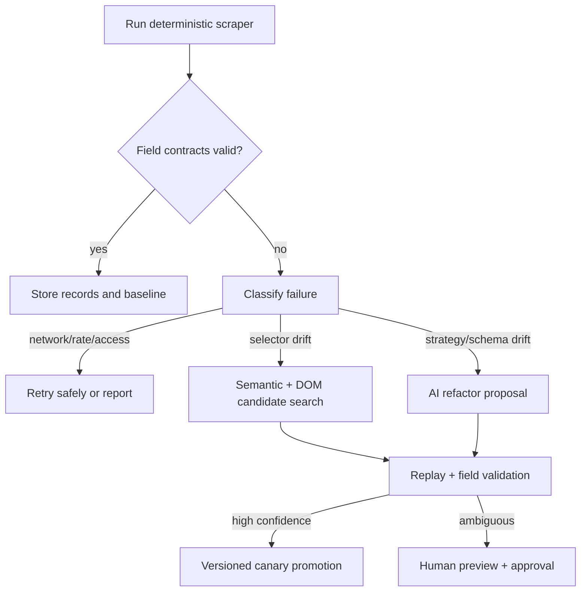

# Comparison and Decision Guide

This is the decision layer across [[03-Healenium-Algorithm]], [[05-Playwright-Agent-Healing]], and [[06-BrightData-Workflow]].

## Comparison

| Dimension | Healenium | Playwright AI Agent | Bright Data CLI |
|---|---|---|---|
| Primary target | Selenium element lookup | Playwright test selectors + generated code | Hosted custom scrapers |
| Trigger | `NoSuchElementException` / configured multi-find path | health-state degradation from wrapped actions | external caller decides scraper is wrong |
| Memory | historical DOM node paths in backend | JSON registry + current Scout file | hosted scraper/template state |
| Candidate source | DOM structural similarity | accessibility tree + DOM hooks + optionally model | hosted AI refactor |
| Candidate execution check | must resolve uniquely in browser | candidates are filtered/ranked locally | service produces preview/diff |
| Semantic data validation | no | no native field validation | preview available; caller must judge |
| Human gate | dashboard/report-oriented | quarantine after repeated repairs | explicit approval by default |
| Best lesson | preserve historical structure | explicit selector health and bounded authority | versioned human review around AI code change |

## What to use for which problem

| Problem | Best initial choice |
|---|---|
| A site changed CSS classes but retained page structure | semantic selector first; Healenium-style path similarity as fallback |
| A modern web app changed element roles/test hooks | Playwright Scout / a11y discovery |
| Field moved from DOM to embedded JSON or an authorized endpoint | strategy-level refactor, potentially Bright Data AI |
| Browser blocked or user session expired | no healing; stop and report |
| You need auditability before changing production extractor code | Bright Data-style preview, approval, versioning |

## Recommended hybrid policy

## A good automatic-promotion policy

For a given repair candidate, require all of the following:

1. it works on at least several representative URLs, not only the failed page;
2. every required field passes schema typing and completeness checks;
3. field semantics pass rules (currency, positive price, canonical item identity);
4. data distribution is not a high-severity historical anomaly;
5. candidate selector/extractor is stable, unique, and explainable;
6. all evidence is stored with a repair version.

If a repair cannot meet those conditions, it is a **proposal**, not a self-healed production change.

## Non-negotiable scope boundary

Self-healing is not a mechanism for defeating a site’s authentication, CAPTCHA, access policy, or rate controls. These are authorization or operational boundaries, not faulty selectors. Refer to [[01-Core-Concepts]].

