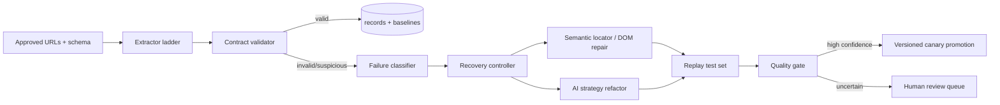

# ScrapeSentinel: Recommended Scraper Blueprint

This is the practical synthesis of [[01-Core-Concepts]], [[03-Healenium-Algorithm]], [[05-Playwright-Agent-Healing]], and [[06-BrightData-Workflow]].

## Product idea

**ScrapeSentinel** is an evidence-backed self-healing extractor. Given approved public URLs and a schema, it extracts records, detects data drift, proposes repair, validates repairs, and exposes a reviewable repair history.

## Target data contract

Use a typed contract rather than arbitrary text extraction:

```python
class Product(BaseModel):
    source_url: HttpUrl
    canonical_id: str | None
    title: str
    price_amount: Decimal | None
    currency: str | None
    availability: Literal['in_stock', 'out_of_stock', 'unknown']
    extracted_at: datetime
    evidence: dict
    confidence: float
```

The `evidence` object should contain locator/API path, small source snippet or hash, layout fingerprint, extraction strategy, and repair version.

## Runtime architecture



## Extractor ladder

Use the lowest-cost, clearest evidence first:

1. documented, authorized API;
2. JSON-LD / embedded structured state;
3. static HTML extraction;
4. Playwright rendered DOM;
5. semantic a11y/DOM discovery;
6. bounded LLM-assisted strategy proposal.

This ensures the model does not become the normal runtime parser.

## Data-health detector

Trigger a repair investigation from field-level signals, not only exceptions:

- required-field null rate rises;
- item count is materially below its baseline;
- types do not parse;
- price/currency violate constraints;
- a stable page fingerprint changes sharply;
- a record’s canonical ID/title no longer agrees with the requested URL.

Track a short rolling window and an all-time baseline. The Playwright project only uses lifetime rate; do not duplicate that limitation.

## Repair candidate contract

Every candidate should be represented as data, not only code text:

```json
{
  "strategy": "json_ld | api | playwright_locator | css | xpath",
  "locator_or_path": "...",
  "field": "price_amount",
  "why": "Current page has price in JSON-LD offers.price",
  "evidence": {"layout_hash": "...", "sample": "..."},
  "confidence": 0.94,
  "repair_version": 7
}
```

## Verification protocol

Before automatic promotion:

1. replay 3–10 representative URLs including the failure;
2. require all schema constraints;
3. compare record identity and normalized values against independent signals;
4. calculate missingness, uniqueness, and distribution deltas;
5. execute under a canary version;
6. persist before/after outputs, rejection reasons, and rollback pointer.

## Suggested repository layout

```text
src/
  contracts/       Pydantic schemas and field validators
  extractors/      api.py, jsonld.py, html.py, browser.py
  discovery/       a11y_dom_scout.py, page_fingerprint.py
  health/          drift.py, classifier.py, baselines.py
  healing/         candidates.py, ranker.py, verifier.py, promoter.py
  integrations/    brightdata.py
  storage/         records.py, repair_events.py
  api/             FastAPI endpoints
ui/                repair dashboard
fixtures/          v1, v2, v3 deliberately broken page variants
```

## Best hackathon demo

Use controlled fixtures so the demo is legal, deterministic, and explainable:

1. baseline product page extracts correctly;
2. classes rename — semantic locator repair succeeds;
3. price moves into JSON-LD — strategy repair succeeds;
4. multiple prices appear — validator rejects wrong candidate;
5. dashboard displays evidence, confidence, repair diff, and approve/promote action.

The fourth case is your differentiator: your system refuses a plausible but semantically wrong repair.

